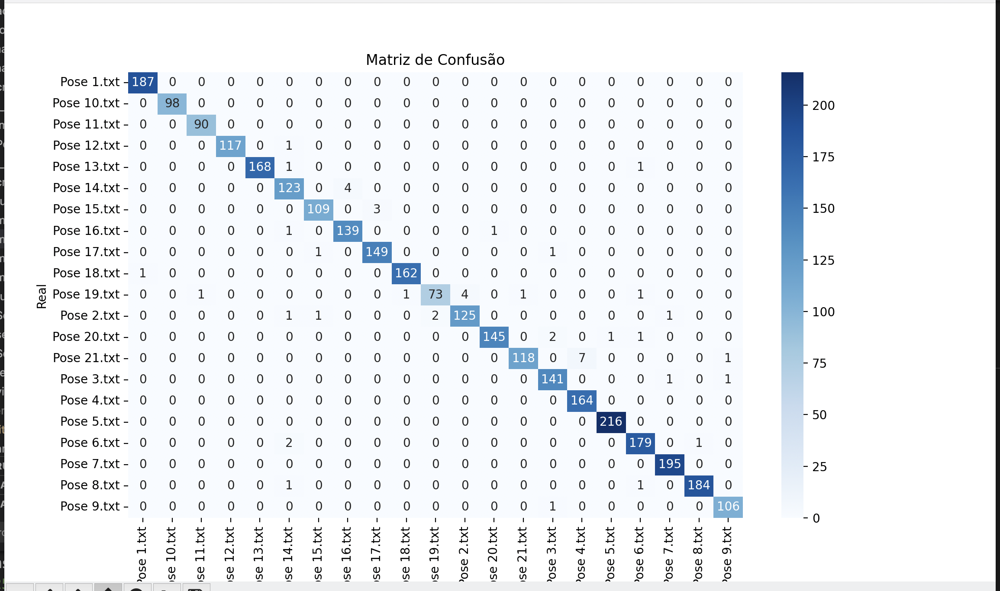

# Pose Corrector

Este projeto é composto por um **frontend** Next.js e um **backend** FastAPI que expõe um endpoint para análise de poses usando MediaPipe.

## Pré-requisitos

- Docker & Docker Compose  
- (Opcional) Python 3.9+ e `venv` para rodar localmente sem container

---

## Estrutura do Projeto

/
├── Front/pose-corrector/…      # App Next.js (frontend)  
├── Back/                        # API FastAPI (backend)  
│   ├── main.py                 # Ponto de entrada FastAPI  
│   ├── requirements.txt        # Dependências Python  
│   └── pose_landmarker.task    # Modelo MediaPipe Task  
├── Scripts/…                    # Helpers Python usados pelo backend  
└── docker-compose.yml

---

## Usando Docker Compose

1. Clone este repositório  
2. Na raiz do projeto, execute:

   ```zsh
      docker-compose up --build
   ```

3. Acesse:
   - Frontend: <http://localhost:3000>  
   - Backend (OpenAPI): <http://localhost:8000/docs>

Para parar e remover containers:

```bash
docker-compose down
```

---

## Executando Localmente (sem Docker)

### 1. Backend

```bash
cd Back
python3 -m venv .venv
source .venv/bin/activate      # macOS/Linux
# .\.venv\Scripts\activate     # Windows cmd/powershell

pip install -r requirements.txt
# garanta que pose_landmarker.task está em Back/
uvicorn main:app --reload --host 0.0.0.0 --port 8000
```

### 2. Frontend

```bash
cd Front/pose-corrector
npm install
npm run dev
# ou
yarn
yarn dev
```

---

## Testando a API

Use a interface Swagger em `http://localhost:8000/docs` para enviar uma imagem ao endpoint:

# modelo

para rodar ele é so rodar o script model.py

A seguinte é a quantidade que esta certo


